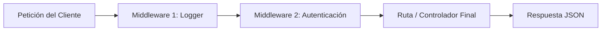

# Lección 2: Parámetros de Ruta y el Patrón Middleware

El núcleo fundamental de Express se basa en una cadena de funciones llamadas **Middlewares**. En esta lección aprenderás a interceptar peticiones, extraer parámetros de la URL y autenticar accesos.

---

## 1. Parámetros de Ruta Dinámicos (`req.params`)

Para capturar segmentos dinámicos de una URL (como el identificador único de un curso o un usuario), utilizamos dos puntos `:nombreParametro`:

```javascript
app.get('/api/cursos/:slug', (req, res) => {
  const { slug } = req.params;
  
  const cursoEncontrado = cursos.find(c => c.slug === slug);

  if (!cursoEncontrado) {
    return res.status(404).json({ error: "Curso no encontrado" });
  }

  res.json(cursoEncontrado);
});
```

---

## 2. ¿Qué es un Middleware?

Un **Middleware** es una función que tiene acceso al objeto de petición (`req`), al objeto de respuesta (`res`) y a la siguiente función en el ciclo de solicitud-respuesta (`next`).



### Ejemplo: Logger de peticiones personalizadas

```javascript
// Middleware personalizado
const loggerMiddleware = (req, res, next) => {
  const fecha = new Date().toISOString();
  console.log(`[${fecha}] ${req.method} ${req.url}`);
  
  // ¡Crucial! Llamar a next() para pasar el control al siguiente middleware
  next();
};

// Aplicar globalmente a todas las rutas
app.use(loggerMiddleware);
```

---

## 3. Middlewares de Autenticación y Protección

Podemos aplicar middlewares solo a rutas específicas que requieran seguridad:

```javascript
function verificarApiKey(req, res, next) {
  const apiKey = req.headers['x-api-key'];

  if (apiKey !== 'secreto-eduxp-123') {
    return res.status(401).json({ error: "No autorizado: API Key inválida o ausente" });
  }

  next();
}

// Ruta protegida
app.delete('/api/cursos/:id', verificarApiKey, (req, res) => {
  res.json({ mensaje: `Curso ${req.params.id} eliminado con éxito` });
});
```

> [!TIP]
> Los middlewares se ejecutan en estricto orden secuencial. Si olvidas invocar la función `next()`, la petición del cliente quedará suspendida en espera indefinida.
